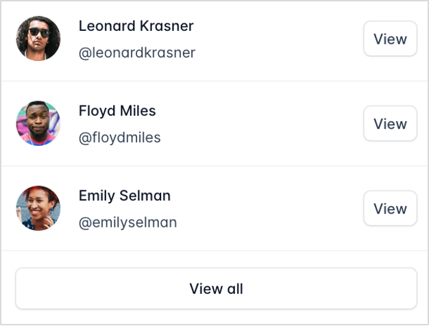
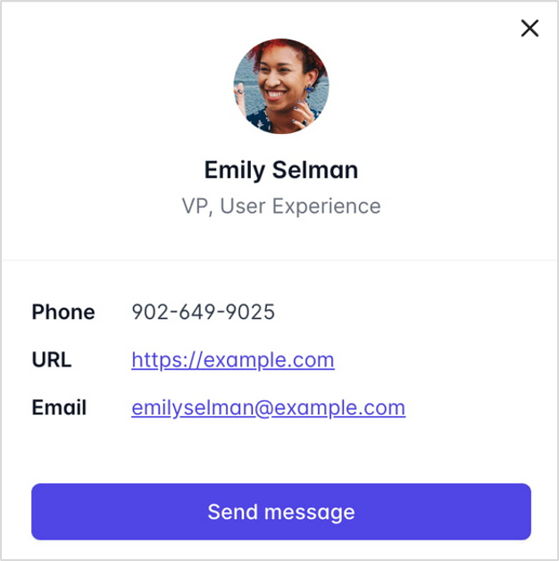

# technical-task

### Create a React app containing Users widget. It should have two states:

1. First state shows the users list. By default it shows three items. If there are more than three it shows a “View all” button. Which expands the rest of the list when clicked on it. Each item has an avatar, short user information and a “View” button. Design example:

2. Second state shows full user information after clicking on “View” button. It has a “Close” button to go back to the Users list. Button “Send message” does nothing. Design example:

- Initial input data: initData.json

**Requirements:**
- The Users data should be stored in the Redux.
- Widget should receive data through props.
- Widget should be adoptive - from fixed size on desktop to responsive on mobile devices.
- App builds with no warnings.
- Components and containers of the app covered with the tests.
- Important! It is not allowed to use any styles library.

**Frameworks:**
- React 18 (last possible version) with Typescript.
- Redux Toolkit.
- Jest and RTL for testing.
- Plain CSS3 / HTML5.

Estimated time - 3.5 h
